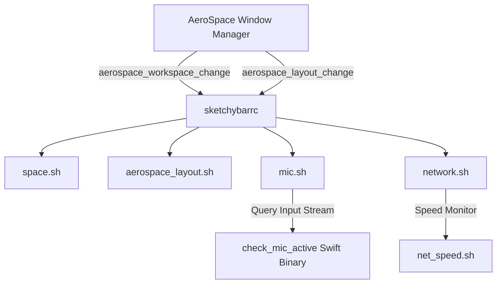

# Codebase Knowledge Index & Map

## 1. Architecture Overview
- **Workspace Target**: `/Users/aaravshah2975/.config`
- **Environment**: macOS Window Management, Custom Status Bar & System Tools
- **Core Components**:
  - `sketchybar/` : Status bar configuration, custom widgets, and event-driven plugins
  - `aerospace/` : i3-inspired window manager configuration, layout orientation rules, and workspace assignments

## 2. Component & Directory Map

### AeroSpace Window Manager (`.config/aerospace/`)
- [`aerospace.toml`](file:///Users/aaravshah2975/.config/aerospace/aerospace.toml) : Master config file
  - **Normalization**: Flat containers enabled, opposite orientation for nested containers
  - **Orientations & Splits**: `ctrl-alt-b` (Horizontal split), `ctrl-alt-v` (Vertical split), `ctrl-alt-t` (Floating toggle), `ctrl-alt-e` (Balance sizes)
  - **Workspaces**: 13 persistent workspaces (`1-4`, `A`, `B`, `C`, `E`, `M`, `P`, `S`, `T`, `V`) bound to application regex patterns

### Sketchybar System Bar (`.config/sketchybar/`)
- [`sketchybarrc`](file:///Users/aaravshah2975/.config/sketchybar/sketchybarrc) : Main bar layout, event listeners, item registrations, and brackets
- [`colors.sh`](file:///Users/aaravshah2975/.config/sketchybar/colors.sh) : Shim sourcing `~/.local/bin/cosmere_colors.sh` (Cosmere palette)
- **Key Plugins (`.config/sketchybar/plugins/`)**:
  - `aerospace_layout.sh` : Tiling layout indicator icon (`󰒡`/`󰕰`/`󰓩`) & click popup menu
  - `mic.sh` : Dynamic microphone widget (`#FF3B30` pulsing red on live stream, `#00E5FF` cyan on unmuted standby, `#8899A6` silver when muted)
  - `check_mic_active` : Swift compiled binary leveraging macOS CoreAudio native API (`kAudioDevicePropertyDeviceIsRunningSomewhere`)
  - `battery.sh` : Power level status & remaining runtime estimator (`HH:MM`)
  - `weather_widget.sh` : Non-blocking cached weather fetcher (`/tmp/sketchybar_weather_cache`)
  - `network.sh` : SSID, Local IP, and Public IP status tracker (`/tmp/sketchybar_public_ip`)
  - `space.sh` : Workspace switcher pill with open window counter `(N)`
  - `trash.sh` : Trash purger popup with size (`MB`) and file count preview

## 3. Dependency & Event Call Architecture

## 4. Temporary State Files (`/tmp/`)
- `/tmp/sketchybar_mic_volume` : Persisted mic volume for smart mute/unmute restore
- `/tmp/sketchybar_weather_cache` : 15-min background cached weather data
- `/tmp/sketchybar_public_ip` : 1-hour background cached WAN public IP
- `/tmp/sketchybar_net_speed.state` : Previous byte counts for bandwidth calculation
